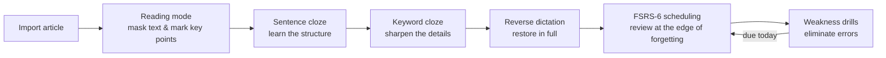

> **Update Pause Notice**
> All updates to this repository are suspended.
> Updates will resume no earlier than June 10, 2027.

**Blancall NoAI** ｜ [简体中文](README.md)

[](LICENSE) [](https://www.android.com/) [](https://kotlinlang.org/) [](https://developer.android.com/compose)

**Not "blank all", but "recall".** Blancall turns any article into fill-in-the-blank exercises, helping you truly memorize what matters — in a modern, efficient, and trustworthy way.

Blancall is an open-source project that converts any article into cloze practice. Review scheduling is powered by the forgetting curve, and all data stays on your device — nothing goes to the cloud.

The standard (NoAI) edition **contains no AI modules whatsoever**: no AI integration, no AI settings, no AI entry points — a pure, complete, fully offline practice tool.

## Screenshots

<!-- Screenshots to be added: place images in docs/screenshots/ and uncomment below
| Reader | Practice |
|---|---|
|  |  |

| Statistics | Handwriting |
|---|---|
|  |  |
-->

## Highlights

Blancall turns any article into cloze practice and uses memory science to help you truly remember.

**Six core selling points**:

- **Four practice modes** — sentence cloze / keyword cloze / reverse dictation / custom cloze, a progressive path covering every memory level
- **Daily sentence card** — one sentence auto-picked each day; three-key ratings feed the FSRS scheduler, so fragmented time still moves review forward
- **Handwritten answers (in-house models)** — self-trained recognition models (7,356 Chinese classes / 47 Latin classes) running on-device via NCNN: write it, and it gets graded
- **Reading-page masking** — mask the original text right on the reading page; read and memorize in one place
- **Custom cloze & mask positions** — mark exam points sentence-by-sentence / word-by-word / character-by-character, saved as named presets you can reuse anytime
- **Multi-format import** — paste / TXT / PDF (with preview) / Word, auto-split into sentences and paragraphs; start marking key points right after import

**The learning loop**:



### 1. Core Practice Engine

| Feature | What it does | When to use | What you get |
|---|---|---|---|
| Multi-format import | Paste text, or import TXT, PDF (with preview), Word, etc.; automatic sentence/paragraph splitting; one-tap suggested title; oversized text is trimmed with a warning; "Save & Cloze" jumps straight into marking | Textbooks, handouts, papers, recitation outlines, exam materials | Turn any article into practice material in seconds, no manual prep |
| Four practice modes | ① Sentence cloze: hide parts of sentences, recall from context; ② Keyword cloze: hide key words to sharpen accuracy; ③ Reverse dictation: shuffle paragraphs, restore in full; ④ Custom cloze: apply pre-marked positions | Sentence mode for first pass, keyword mode for consolidation, reverse dictation before exams, custom for key points | A progressive path: structure → details → full recall |
| Four cloze granularities | Complex sentence / clause / word / single character; long-press during practice to cycle | Adjust difficulty as you improve | Train the same article from "glance and fill" down to dictation level |
| Three cloze strategies | Balanced, Weakness-first (targets your past mistakes), Full coverage; switch anytime via the "⋮" menu | Daily practice, targeted review, stage testing | What gets hidden is driven by your error data, not luck |
| Cross-article mixing | Long-press in "My Articles", select 2+ articles, practice with mixed cloze | Term review; breaking single-article context dependence | Cure the "won't recall it in another article" problem |
| Weakness drills | From a practice record tap "Review ›", or enter from the "Due" card, to practice only your past mistakes | Pre-exam gap filling | Practice time goes exactly where it matters |
| Resume practice | The "Continue" card restores unfinished practice with full state | Interruptions (class, commute, bedtime) | Stop and resume anytime, zero friction |
| Two-level hints | Toggle hints mid-practice; partial answers help you through blocks; weak and strong hint levels | Beginners, stuck moments, turning hints off for exam simulation | You control hint strength; ramp up to pure recall |
| Immersion & section mode | Enable immersion to block distractions; split long articles into sections and practice selected ones | Practicing in public; tackling very long texts | Focus on demand; long articles stop being intimidating |
| Smart grading & error diagnosis | Punctuation tolerance; CJK/Latin mixed-text tolerance (full/half width, case, decimal points); edit-distance diagnosis of typos / missing / extra / wrong-order characters with a similarity score | Poetry and prose dictation, foreign-language passages, character-level checks | No more failing on a comma; you learn *which kind* of mistake you made |
| Daily sentence card | One sentence per day: due reviews first, otherwise a new sentence rotating across articles; swipe up/down; rate with Forgot / Shaky / Got it | Two minutes a day of sentence-level memory | A zero-friction daily habit that compounds |
| Offline handwriting | Switch to handwritten answers: built-in local recognition (NCNN, fully offline), Chinese model with 7,356 classes (HWDB full set: 7,185 characters + 171 alphanumerics), Latin model with 47 classes (EMNIST); embedded board, pressure-aware ink, automatic character splitting for continuous writing | Stylus dictation; testing memory through real writing | Handwriting mirrors real exams, and recognition never leaves the device |

### 2. Memory Science Engine

| Feature | What it does | When to use | What you get |
|---|---|---|---|
| FSRS-6 scheduling | The FSRS-6 algorithm (ported from Anki's fsrs-rs, default 90% target retention) schedules every item; sentence-card ratings feed the scheduler | All long-term memory management | Reviews land at the edge of forgetting, automatically |
| Forgetting prediction | Predicts each item's memory strength; due items surface via the "Due" card | The first thing to check each day | Review at minimum cost for maximum retention |
| Adaptive difficulty | Adjusts future cloze difficulty from your accuracy history | Long-term use as content grows | Difficulty tracks your level — neither discouraging nor wasteful |
| Memory heatmap & decay curve | Heatmap of overall memory strength; decay curve visualizes forgetting trends | Stage reviews; pre-exam assessment | See your readiness at a glance |

### 3. Reading & Organizing

| Feature | What it does | When to use | What you get |
|---|---|---|---|
| Immersive reading | Font size, line height, typeface, weight, palette, occlusion granularity; pinch to zoom; vector rendering stays crisp | Pre-class reading, bedtime review | A reading experience tuned to your eyes, closing the read → mark → practice loop |
| Custom occlusion marking | Switch occlusion to "Custom" and mark sentences / words / characters; save multiple named configurations | Highlighting key exam points | Practice always lands on what you marked as important |
| Personalized home | Long-press to edit: drag, resize, pin, add/remove cards; pull-down brand header; custom logo & subtitle | Tailoring the home screen | Your most-used actions one tap away |
| Local reminders | Daily study reminders via local notifications, time and cadence adjustable | Forgetting to practice | A gentle nudge, generated entirely on-device |

### 4. Insights & Motivation

| Feature | What it does | When to use | What you get |
|---|---|---|---|
| Global statistics | Practice counts, accuracy, mode distribution, trends; calendar view of daily volume | Weekly / monthly review | Consistency made visible |
| Per-article stats & records | Per-article attempts, accuracy, total time; every session inspectable | Checking one article's progress | Know what's solid and what's shaky at a glance |
| Multi-dimensional charts | Radar chart, error-type bar chart (typo / missing / extra / wrong-order, down to the character), memory decay curve | Analyzing error composition | Know whether you err on characters or on order |
| Needs-work recommendations | Automatically surfaces your lowest-accuracy articles | When you don't know what to practice | The system decides for you |
| Achievements | Milestone-based positive feedback | Long-term persistence | Motivation built in |
| Share cards | One-tap branded result posters | Sharing progress | Let your effort be seen |

### 5. Import & Export

| Feature | What it does | When to use | What you get |
|---|---|---|---|
| PDF test paper export | Export a practice session as a printable PDF | Paper-based self-testing, mock exams | Practice beyond the screen |
| CSV record export | Export all practice records as CSV | Analysis, backup, migration | Your data is always yours to take |

### 6. Privacy & Security

- **Local-only storage**: articles and practice data never leave your device. No account, no cloud, no forced upload.
- **Fully offline capable**: every feature works without a network.
- **No AI modules**: no AI code paths, settings, or entry points exist in the app — not "switched off", but "never there". Ideal for users with strict privacy needs or no want for AI.

### 7. Edition Comparison

| Capability | Blancall NoAI (this repo) | Blancall (Pro edition) |
|---|---|---|
| Core practice / memory engine / stats / handwriting / import-export | ✅ Full | ✅ Full |
| AI study assistant (own API / AI cloze / web search / chat history) | ❌ No AI modules at all | ✅ Pro exclusive |
| Best for | Users who want a pure, privacy-first practice tool | Users who want AI question generation, Q&A, and error analysis |

> Positioning: **AI removed, nothing else missing**. Every non-AI capability matches the Pro edition — this is not a "crippled" version, but the complete edition for people who don't need AI.

## Install

This project is distributed as source code. **No APK is provided** — build it yourself.

### Requirements

- Android Studio
- Kotlin
- (Other dependencies are managed by Gradle)

### Clone & build

```bash
# Clone the repository
git clone https://github.com/ilyskyo/Blancall-NoAI.git

# Open the project in Android Studio
# Wait for the Gradle sync to finish
# Click Run to build and install
```

## Data & Backup

- All data (articles, practice progress, statistics) lives only in the app's private directory on your device. No account, no cloud.
- CSV export covers **practice records**; there is currently no one-tap full backup of the article library or progress.
- Device migration: use your system or vendor migration tool to move app data (completeness not guaranteed), or re-import articles on the new device.

## FAQ

**Why is there no APK?**

The project is open-sourced as source code for learning, research, and self-building. No prebuilt installers are distributed.

**Standard (NoAI) or Pro?**

The only functional difference is AI — see the edition comparison above. Choose this repository for a pure, fully offline practice tool; choose Pro ([Blancall](https://github.com/ilyskyo/Blancall)) for AI cloze, Q&A, and web verification.

**Does it need the internet?**

Not at all. Every feature works offline, and the app contains no AI modules to begin with.

## License

The source code is released under the **MIT License** (see the [LICENSE](LICENSE) file).

> **Scope note**: The MIT commercial grant applies to this project's source code. The sole exception is the bundled handwriting recognition model weights (`app/src/main/assets/hccr`, `hccr_en`), which are excluded from the commercial grant due to training-data licensing and are provided for learning and research only (see below).

### Fonts

The bundled font **Noto Sans SC** (Google & Adobe; Source Han Sans / Noto Sans CJK family) is licensed under the **SIL Open Font License 1.1** — free for commercial use and bundling.

- Font page: https://fonts.google.com/noto
- Repository: https://github.com/notofonts/noto-cjk

The circular mark on the app icon is rendered with a glyph from **LXGW Neo XiHei**, derived from "IPAex Gothic", under **SIL Open Font License 1.1** and **IPA Font License 1.0** — free for commercial use and bundling.

- Repository: https://github.com/lxgw/LxgwNeoXiHei

### FSRS spaced repetition

This app uses **FSRS-6** (Free Spaced Repetition Scheduler), ported from Anki's open-source **fsrs-rs** (v6, including v6.6.0) with reference to **FSRS-Kotlin**, using default parameters (default target retention 90%).

- Paper: Ye, J., Su, J., & Cao, Y. (2022). *A Stochastic Shortest Path Algorithm for Optimizing Spaced Repetition Scheduling*. https://doi.org/10.1145/3534678.3539081
- FSRS-6 algorithm: https://github.com/open-spaced-repetition/awesome-fsrs/wiki/The-Algorithm
- fsrs-rs: https://github.com/open-spaced-repetition/fsrs-rs
- fsrs-kotlin: https://github.com/open-spaced-repetition/FSRS-Kotlin

### Liquid Glass rendering

The Liquid Glass visuals are built on:

- **AndroidLiquidGlass** by Kyant0, **Apache License 2.0** — https://github.com/Kyant0/AndroidLiquidGlass
- **AndroidLiquidGlassView** by QmDeve, **MIT License** — https://github.com/QmDeve/AndroidLiquidGlassView

Full license texts, copyright notices, and modification notes are in [THIRD-PARTY-LICENSES](THIRD-PARTY-LICENSES).

### Handwriting recognition models

The bundled local handwriting models (NCNN inference, fully offline) were trained in-house:

- **Chinese model**: 7,356 classes (HWDB full set: 7,185 characters + 171 alphanumerics), trained on **CASIA-HWDB** (Chinese Academy of Sciences handwriting database, non-commercial academic research use only).
- **Latin model**: 47 classes (EMNIST Balanced: digits + upper/lowercase letters), trained on **EMNIST** (public NIST-derived dataset).

> **Usage statement**: because CASIA-HWDB is restricted to non-commercial academic research, the handwriting model weights are excluded from the MIT commercial grant and are for learning and research use only.

## Disclaimer

This software is provided "as is", without warranty of any kind, express or implied. The author is not liable for any data loss or business interruption caused by using this code.

## AI-Generated Software Statement

This software may contain code or content generated by AI systems (including but not limited to large language models, code generation tools, autocompletion systems, and intelligent coding agents).

1. AI-generated content: parts or all of this software's code may originate from AI model output; the developer has reviewed and integrated it to the best of their ability.
2. No warranty: this software is provided "AS IS" without any express or implied warranties, including merchantability, fitness for a particular purpose, and non-infringement.
3. AI-generated code may contain errors, security vulnerabilities, hallucinated logic, or incomplete reasoning. The developer has done their best to review and integrate the code but cannot guarantee the completeness, correctness, security, or fitness of AI-generated content. You are strongly advised to review, test, and security-assess the code before use.
4. Recommendation: perform a thorough code review and testing before production use.
