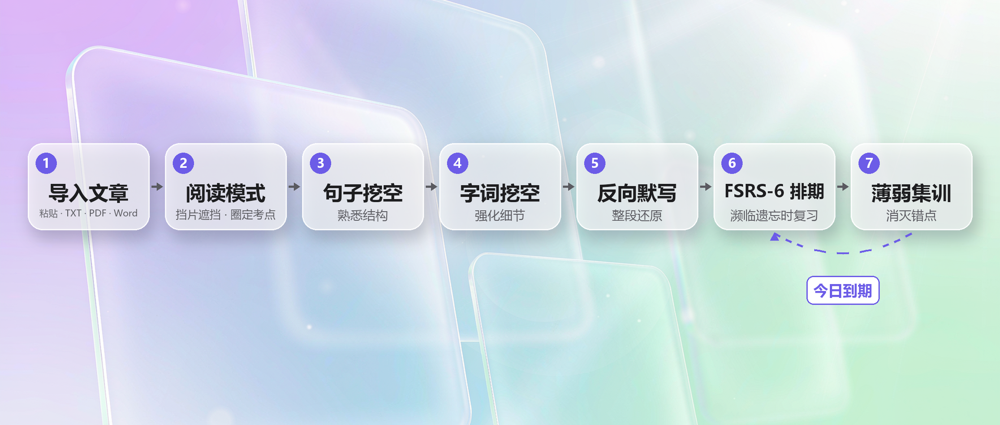

> **暂停更新公告**  
> 本仓库即日起停止一切更新活动。  
> **恢复更新日期：不早于 2027 年 6 月 10 日。**

**Blancall NoAI** ｜ [English](README.en.md)

[](LICENSE) [](https://www.android.com/) [](https://kotlinlang.org/) [](https://developer.android.com/compose)

**Not “blank all”, but “recall”**.Blancall helps you turn any article into fill-in-the-blank exercises. It offers a modern, efficient, and trustworthy way to master the content you need to memorize.

**不是清空，是召回。** Blancall，把文章变填空，帮你用现代又靠谱的方式，真正记住东西。

Blancall 是一个帮助你把任何文章转化为挖空练习的开源项目。基于遗忘曲线调度复习，所有数据本地存储，不上云。

## 界面预览

<!-- 截图待补充：图片放入 docs/screenshots/ 后取消下方注释
| 阅读页 | 练习页 |
|---|---|
|  |  |

| 统计页 | 手写作答 |
|---|---|
|  |  |
-->

## 功能亮点

Blancall 把任何文章变成挖空练习，用记忆科学帮你真正记住内容。标准版（NoAI）**不含任何 AI 功能模块**：无 AI 接入、无 AI 设置、无 AI 入口——一个纯粹、完整、完全离线的背诵工具。

**六个核心卖点**：

- **四种练习模式** —— 句子挖空 / 字词挖空 / 反向默写 / 自定义挖空，难度递进覆盖记忆全层级
- **句子卡片（每日一句）** —— 每天自动挑一句，三键评级进 FSRS 调度，碎片时间推进复习
- **手写作答（自训模型）** —— 自训练识别模型（中文 7356 类 / 拉丁 47 类），NCNN 本机推理，写出来就判得准
- **阅读挡片遮挡** —— 阅读页直接遮挡原文字句，边读边背
- **自定义挖空和挡片位置** —— 逐句 / 逐词 / 逐字标注考点，多套命名配置随时套用
- **导入支持多格式** —— 粘贴 / TXT / PDF（可预览）/ Word，自动分句分段，导完即可圈考点

**学习闭环**：



### 一、核心背诵引擎

| 功能 | 它做什么 | 适用场景 | 为你带来的价值 |
|---|---|---|---|
| 多方式文章导入 | 支持粘贴文本、TXT、PDF（可预览）、Word 等文件导入；自动分句分段；标题留空可一键采用从正文提取的建议标题；超大文本提示并截断；「保存并挖空」导完直接圈定考点 | 课文、讲义、论文、背诵提纲、考试资料 | 十几秒内把任何一篇文章变成可练习的背诵材料，无需手工整理 |
| 四种练习模式 | ① 句子挖空：隐藏部分句子内容，借上下文回忆原文；② 字词挖空：只藏关键字词，强化易错点；③ 反向默写：段落打散、整段还原；④ 自定义挖空：套用你预先圈定的位置 | 初学用句子挖空，巩固用字词挖空，考前用反向默写，冲刺重点用自定义 | 难度递进的完整记忆路径：先熟悉结构 → 再强细节 → 最后整段还原 |
| 四级挖空粒度 | 复句 / 分句 / 字词 / 单字四档粒度，练习中长按即可循环切换或还原 | 随掌握程度随时调整难度 | 同一篇文章可以从"扫一眼补全"一路练到"逐字听写级"，一份材料吃干榨净 |
| 三种挖空策略 | 均衡（平均分布）、薄弱优先（专挖你错过的地方）、全覆盖（尽量覆盖全文），练习中通过「⋮」随时切换 | 日常练习、专项复习、阶段检测 | 挖哪里不再是随机碰运气，而是由你的错误数据驱动 |
| 跨文混合练习 | 「我的文章」长按多选 2 篇以上，混合抽空、错开练习（使用智能挖空） | 期末总复习、多篇课文一起背、防止依赖单篇上下文 | 打破"换一篇就不会"的单篇记忆定势 |
| 薄弱集训 | 从统计页练习记录点「复习 ›」或从「待复习」卡片进入，只练你曾经错过的位置 | 考前查漏补缺、消灭顽固错点 | 练习时间全部花在刀刃上 |
| 断点续练 | 「继续做」卡片一键回到上次未完成的练习，进度与状态完整保留 | 中途被打断（上课、通勤、睡前） | 随时练、随时停、随时接上，零心理负担 |
| 两级提示系统 | 练习中一键开关提示，卡壳时看部分答案辅助回忆；提供弱提示与强提示两级 | 初学阶段、卡壳过渡、熟悉后关闭提示模拟考试 | 提示强度自己掌控，避免长时间卡顿破坏节奏，也能逐步过渡到全凭回忆 |
| 沉浸模式与段落分层 | 「⋮」菜单可开启沉浸模式屏蔽干扰；长文可按段落分层，只练选定的段落 | 公共场合专注背诵；超长文章分而治之 | 屏蔽视觉噪音，长文不再望而生畏 |
| 智能判分与错因诊断 | 标点容错、中英文混排容错（全半角归一、英文大小写容错、数字小数点保留）；基于编辑距离精确诊断错别字 / 少字 / 多字 / 顺序错 / 完全不对，并给出答案相似度 | 默写古诗古文、背诵外语段落、逐字级检验 | 不再"差一个标点算全错"，也不再把"顺序写反"笼统算错——错在哪一类、错到什么程度，判分结果直接告诉你 |
| 句子卡片（每日一句） | 首页每天自动挑一个完整句子：优先安排到期复习，没有到期则跨文章轮换抽新句；大卡片上滑下一张、下滑回看（回看不评级），底部「忘记 / 不熟 / 记住了」三键评级 | 每天花一两分钟做轻量句子级记忆 | 零门槛的每日背诵习惯，碎片时间也能推进复习进度 |
| 手写作答（离线） | 练习作答可切换手写：内置本地手写识别模型（NCNN 推理，完全离线运行），中文模型覆盖 7356 类字符（HWDB 全集 7185 汉字 + 171 字母数字符号），英文/拉丁模型 47 类（EMNIST）；书写板就地内嵌不弹层，支持压感屏显、连续书写自动按文种拆分单字 | 用手写笔 / 触控笔练字级默写，或想在真实书写中检验记忆 | 手写 ≈ 考场真实作答，且识别全程在本机完成——不联网也能"写出来就判得准" |

### 二、记忆科学引擎

| 功能 | 它做什么 | 适用场景 | 为你带来的价值 |
|---|---|---|---|
| FSRS-6 间隔重复排期 | 采用 FSRS-6 算法（移植自 Anki 开源实现 fsrs-rs，默认目标留存率 90%）自动安排每个知识点的复习时间，句子卡片的评级直接进入调度 | 所有内容的长期记忆管理 | 不用自己规划"第几天复习什么"，算法替你把复习安排在濒临遗忘的临界点 |
| 遗忘预测 | 预测每个知识点当前的记忆强度，到期内容通过「待复习」卡片提醒 | 每天打开 App 的第一件事 | 你总在"快要忘掉"的时候复习，用最少的时间保住最牢的记忆 |
| 难度动态调整 | 根据历史正确率自动调整后续挖空难度 | 长期使用、内容越背越多时 | 练习难度跟着你的水平走，既不打击信心也不浪费时间 |
| 记忆热力图与衰减曲线 | 记忆热力图展示整体记忆强度分布，记忆衰减曲线可视化遗忘趋势 | 阶段性回顾、考前评估 | 复习节奏和记忆状态一目了然，考前心里有底 |

### 三、阅读与整理

| 功能 | 它做什么 | 适用场景 | 为你带来的价值 |
|---|---|---|---|
| 沉浸阅读模式 | 调整字号、行距、字体、字重、配色与遮挡粒度；正文双指捏合直接缩放字号；矢量文字渲染保证任意缩放清晰 | 课前通读、睡前重读、护眼阅读 | 阅读体验按你的眼睛定制，同一个 App 里完成"读 → 标 → 练"闭环 |
| 自定义遮挡标注 | 阅读页将遮挡粒度切为「自定义」，逐句 / 逐词 / 逐字标注考点，保存为多套命名配置随时套用 | 圈定高频考点、老师划的重点、易错句 | 考点跟着你的意志走，练习永远打在最需要的地方 |
| 首页个性化桌面 | 长按进入编辑态：拖动换位、自由缩放卡片、固定位置、增删卡片（待复习 / 继续做 / 最近文章 / 文章卡片 / 句子卡片 / 学习数据 / 自定义配置等）；下拉展开品牌顶栏；可自定义 Logo 与副标题 | 按自己的使用习惯布置首页 | 首页长成你的样子，最常用的功能一步直达 |
| 本地学习提醒 | 可设置每日学习提醒（本地通知），提醒时间与频率可调 | 容易忘记背书的日子 | 温和地把你拉回复习节奏，且提醒完全在本机产生 |

### 四、数据洞察与激励

| 功能 | 它做什么 | 适用场景 | 为你带来的价值 |
|---|---|---|---|
| 全局统计大屏 | 练习次数、正确率、各模式分布、趋势总览；学习日历按天回顾练习量（颜色越深练得越多） | 每周 / 每月复盘 | 坚持可视化，偷懒藏不住 |
| 每篇统计与练习记录 | 每篇文章的练习次数、正确率、累计用时；逐次练习记录可查 | 检查某一篇的掌握进度 | 哪篇熟、哪篇生，翻一眼就知道 |
| 多维可视化图表 | 雷达图（多维能力）、错误分布柱状图（错别字 / 漏字 / 多字 / 顺序错分类统计，精确到字）、记忆衰减曲线 | 分析错误构成、定位薄弱维度 | 知道自己错的是"字"还是"序"，复习方向立刻明确 |
| 需加强文章推荐 | 自动找出正确率最低的文章 | 不知该练哪篇时 | 系统替你做决定，精准补强 |
| 成就系统 | 通过练习里程碑给予正反馈 | 长期坚持过程 | 背书也有成就感 |
| 学习分享图 | 一键生成品牌化成绩海报 | 打卡分享朋友圈 / 学习群 | 让坚持被看见 |

### 五、数据导入导出

| 功能 | 它做什么 | 适用场景 | 为你带来的价值 |
|---|---|---|---|
| PDF 试卷导出 | 将练习导出为可打印的 PDF 试卷 | 纸质自测、模拟考试、给同学出题 | 屏幕之外也能检验，考场手感提前练 |
| CSV 记录导出 | 导出全部练习记录为 CSV | 数据分析、备份、迁移 | 你的数据永远属于你，可自由带走 |

### 六、隐私与安全

- **纯本地存储**：文章与学习数据全部只存设备本机，无账号、无云端、无强制上传。
- **完全离线可用**：不联网也能完成全部背诵与统计功能。
- **无 AI 模块**：应用内不存在任何 AI 相关代码路径、设置项或入口——不是"关掉"，而是"从未有过"。适合对隐私要求极致、或完全不需要 AI 的用户。

### 七、与 Pro 版的差异

| 能力 | Blancall NoAI（本仓库） | Blancall（Pro 仓库） |
|---|---|---|
| 核心背诵 / 记忆科学 / 统计 / 手写作答 / 导入导出 | ✅ 完整拥有 | ✅ 完整拥有 |
| AI 学习助手（自配 API / AI 挖空 / 联网搜索 / 对话存档） | ❌ 无任何 AI 模块 | ✅ Pro 专属 |
| 适用人群 | 只要纯粹背诵工具、追求极简与隐私的用户 | 想要 AI 出题、答疑、错因分析的进阶用户 |

> 标准版的定位：**去掉 AI，功能不少**。除 AI 外的所有能力与 Pro 版一致——这不是"阉割版"，而是为"不需要 AI 的人"准备的完整版。

## 安装

本项目以源代码形式分发，**不提供 APK 文件**，需自行编译后使用。

### 环境要求

- Android Studio
- Kotlin
- （其他依赖由 Gradle 自动管理）

### 克隆与编译

```bash
# 克隆仓库
git clone https://github.com/ilyskyo/Blancall-NoAI.git

# 用 Android Studio 打开项目
# 等待 Gradle 同步完成
# 点击 Run 按钮编译安装
```

## 数据与备份

- 所有数据（文章、练习进度、统计）仅存储在设备本机的应用私有目录，无账号、无云端。
- 「CSV 导出」导出的是**练习记录**；文章库与练习进度目前没有一键整体备份功能。
- 换机迁移：可借助系统或厂商换机工具迁移应用数据（完整性不保证），或在新设备上重新导入文章。

## 常见问题（FAQ）

**为什么没有 APK / 安装包？**

本项目以源代码形式开源，供学习、研究与自行构建使用，不提供编译好的安装包。

**标准版（NoAI）和 Pro 版怎么选？**

两者的功能差异只在 AI，见上方「与 Pro 版的差异」。只要一个纯粹、完全离线的背诵工具选本仓库；需要 AI 出题、答疑、联网核验选 Pro（[Blancall](https://github.com/ilyskyo/Blancall)）。

**需要联网吗？**

完全不需要。任何功能均离线可用，应用内也不存在任何 AI 模块。

## 开源许可

本项目源代码以 **MIT 许可证** 发布（见仓库根目录 LICENSE 文件）。

> **许可范围说明**：MIT 许可证的商业使用授权适用于本项目源代码；唯一例外是应用内置的手写识别模型权重文件（`app/src/main/assets/hccr`、`hccr_en`），因训练数据授权限制不在商业授权范围内，仅供学习、研究用途（详见下方「手写识别模型」）。

### 字体

应用在 PDF 导出中内嵌字体 **霞鹜文楷（LXGW WenKai）Medium**，遵循 **SIL Open Font License 1.1** 与 **IPA Font License 1.0** 协议，可免费商用、可随应用捆绑分发。

- 开源仓库：https://github.com/lxgw/LxgwWenKai

应用图标左上角的圆形标识图形使用 **霞鹜新晰黑（LXGW Neo XiHei）** 字体中的字形进行渲染，该字体衍生于「IPAex 黑体」，遵循 **SIL Open Font License 1.1** 与 **IPA Font License 1.0** 协议，可免费商用、可随应用捆绑分发。

- 开源仓库：https://github.com/lxgw/LxgwNeoXiHei

### FSRS 间隔重复算法

本应用采用 **FSRS-6**（Free Spaced Repetition Scheduler）间隔重复算法，移植自 Anki 开源实现 **fsrs-rs**（v6 版本，含 v6.6.0），并参考了 Kotlin 实现 **FSRS-Kotlin**，使用默认参数（默认目标留存率 90%）。

- 论文：Ye, J., Su, J., & Cao, Y. (2022). *A Stochastic Shortest Path Algorithm for Optimizing Spaced Repetition Scheduling*. https://doi.org/10.1145/3534678.3539081
- FSRS-6 算法文档：https://github.com/open-spaced-repetition/awesome-fsrs/wiki/The-Algorithm
- fsrs-rs 开源仓库（FSRS-6 提供方）：https://github.com/open-spaced-repetition/fsrs-rs
- fsrs-kotlin 开源仓库：https://github.com/open-spaced-repetition/FSRS-Kotlin

### 液态玻璃渲染

应用的液态玻璃（Liquid Glass）视觉效果基于以下开源项目实现：

- **AndroidLiquidGlass**（作者 Kyant0），遵循 **Apache License 2.0** 协议
  开源仓库：https://github.com/Kyant0/AndroidLiquidGlass
- **AndroidLiquidGlassView**（QmDeve），遵循 **MIT License** 协议
  开源仓库：https://github.com/QmDeve/AndroidLiquidGlassView

上述组件的完整许可文本、版权声明及修改情况说明见仓库根目录 [THIRD-PARTY-LICENSES](THIRD-PARTY-LICENSES) 文件。

### 手写识别模型

应用内置的本地手写识别模型（NCNN 推理，完全离线运行）由本项目自行训练：

- **中文模型**：7356 类（HWDB 全集：7185 汉字 + 171 字母数字符号），训练数据为 **CASIA-HWDB**（中国科学院自动化研究所发布的手写汉字数据库，仅限非商业学术研究用途）。
- **英文/拉丁模型**：47 类（EMNIST Balanced：数字 + 大小写字母），训练数据为 **EMNIST**（NIST 衍生的公开数据集）。

> **用途声明**：因训练数据 CASIA-HWDB 仅限非商业学术研究用途，本手写识别模型（模型权重文件）不在 MIT 许可证的商业授权范围内，仅供学习、研究用途，不得用于任何商业用途。

## 免责声明

本软件按“现状”提供，不提供任何明示或暗示的担保。作者不对使用本代码造成的任何数据丢失或业务中断承担责任。

## AI 生成软件声明

本软件可能包含由人工智能系统（包括但不限于大语言模型、代码生成工具、自动补全系统及智能编程代理）生成的代码或内容。

声明与责任：
1. AI生成内容：本软件的部分或全部代码可能源自AI模型输出，开发者已在能力范围内进行了审核与整合。
2. 无担保声明：本软件按“现状”（AS IS）提供，不附带任何明示或暗示的担保，包括但不限于适销性、特定用途适用性及不侵权的保证。
3. AI生成的代码可能存在错误、安全漏洞、幻觉逻辑或不完整推理。开发者已尽己所能对代码进行审查与整合，但无法对AI生成内容的完整性、正确性、安全性及特定用途适用性作出任何保证。强烈建议您在使用前进行对代码的审查、测试和安全性评估。
4. 建议：在用于生产环境前，强烈建议进行全面的代码审查和测试。
